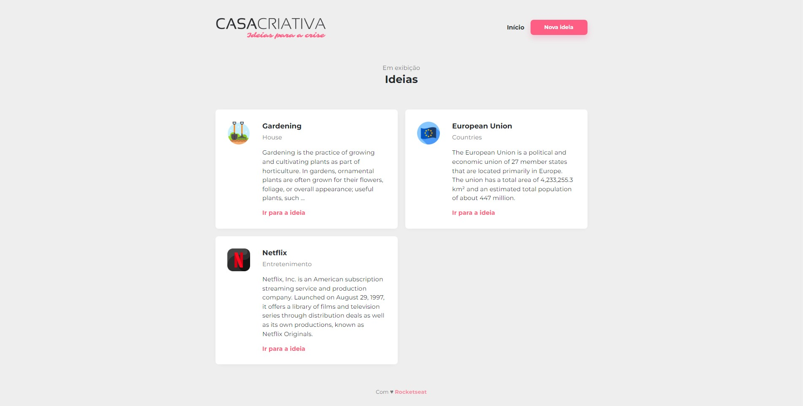

Projeto "Casa Criativa" desenvolvido durante a Semana Omnistack 11.0 com a mentoria de [Mayk Brito](https://github.com/maykbrito) instrutor na [Rocketseat](https://www.rocketseat.com.br/). Casa Criativa é uma aplicação web, que cadastra e exibe ideias de atividades para fazer em casa durante o período de isolamento social. / Project "Creative House" developed during Omnistack week 11.0 under the mentorship of [Mayk Brito](https://github.com/maykbrito) teacher at [Rocketseat](https://www.rocketseat.com.br/). Creative House is a web application that registers e shows ideas for activities to do at home during the social isolation period.

⚙ **Tecnologias Utilizadas / Used technologies**

 - [Node.js](https://nodejs.org/en/)
 - [HTML](https://developer.mozilla.org/en-US/docs/Web/HTML)
 - [CSS](https://developer.mozilla.org/en-US/docs/Web/CSS)
 - [JAVASCRIPT](https://developer.mozilla.org/en-US/docs/Web/JavaScript)
 - [SQLITE](https://www.sqlite.org/index.html)
 - [Express](https://expressjs.com/)
 
-----------------------------------------------------------------------------------------------------------------------------------------------------------------------------------

💻 **Executando o projeto / Running the project**

- Instale as dependências com `npm install` / Install the dependencies with `npm install`
- Inicie o projeto com `npm start` / Start the project with `npm start`

Agora você pode acessar o projeto pelo navegador http://localhost:3000 / Now you can access the project in the browser http://localhost:3000

-----------------------------------------------------------------------------------------------------------------------------------------------------------------------------------

**🧑🏾‍💻 Autor / Author**

**Matheus Gomes de Souza**

LinkedIn: https://www.linkedin.com/in/matheus-gomes-de-souza/  
E-mail: matheusg_souza@outlook.com
